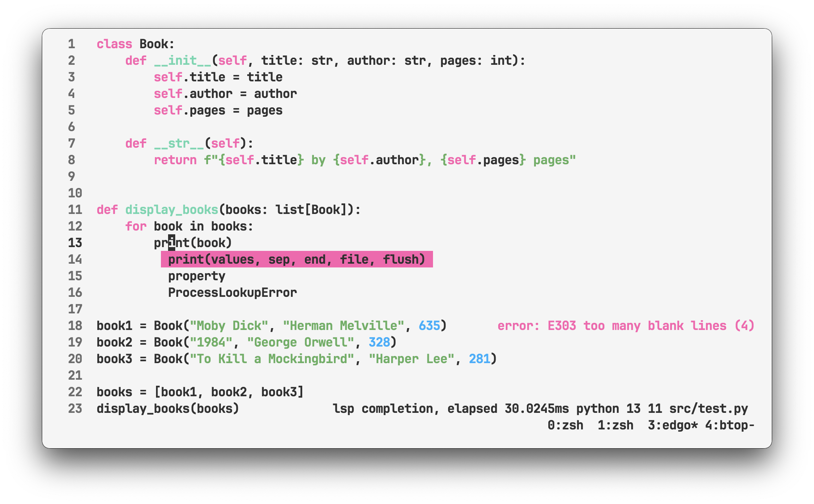

# edgo
Yet another console text editor, but with lsp support



Key bindings and features:
- `Control + s` - save file
- `Esc / Control + q` - quit
- `Control + d` - duplicate line
- `Control + x` - cut 
- `Control + c` - copy 
- `Control + v` - paste
- `Control + u` - undo
- `Control + f` - find
- `Control + t` - files selection tree
- `Option + /` - comment line
- `Control + o` - cursor back
- `Control + ]` - cursor forward


- `Shift + arrow` - select text
- `Option + right/left` - smart horizontal movement by words
- `Option + down/up` - smart vertical movement (adds new line)
- `Control + Shift + down/up` - lines swap


- `mouse selection`  - select text 
- `mouse double click`  - select word 
- `mouse triple click`  - select line


- `Control + space` - lsp completion
- `Control + h` - lsp hover
- `Control + p` - lsp signature help
- `Control + g / Control + mouse click` - lsp definition
- `Control + r / Option + mouse click` - lsp references
- `Control + e` - lsp diagnostic (errors)


### Installation:

Install Go for mac os:
```
brew install go 
echo 'export PATH=$PATH:$(go env GOPATH)/bin' >> ~/.zshrc
```
Clone:   
```shell
git clone https://github.com/vipmax/edgo && cd edgo
go build 
go install .
```

### Usage:
```
edgo [filename]
edgo ~/.zshrc 
```

### Support
If you like the project, please support it.  
`BITCOIN`: `12nVNdrR172b8ZU4CLUVPm3AHqrq2xHMko`  
`ETH` : `0x801b8ecabdd0cf4f6efc3f2624748f9a647987fe`  
`USDT` : `0x801b8ecabdd0cf4f6efc3f2624748f9a647987fe`  


### Lsp

Following lsp features are supported:
- completion
- hover
- signature help
- definition


Following languages are supported:

`go`
```shell  
go install golang.org/x/tools/gopls@latest
```

`python`
```shell  
pip install -U 'python-lsp-server[all]'
```

`javascript/typescript`
```shell  
npm i -g typescript typescript-language-server
```

`html`
```shell  
npm i -g vscode-langservers-extracted
```

`vue`
```shell  
npm i -g vls
```

`rust`
```shell  
#curl --proto '=https' --tlsv1.2 -sSf https://sh.rustup.rs | sh
rustup component add rust-analyzer
```

`c/c++`
```shell  
# go to https://clangd.llvm.org/installation.html
clangd
```

`java`
```shell  
# jdtls requires at least Java 17, check also JAVA_HOME must be set 
brew install jdtls
```

`kotlin`
```shell  
# https://github.com/fwcd/kotlin-language-server
brew install kotlin-language-server
```

`swift`
```shell  
# https://github.com/apple/sourcekit-lsp
xcrun
```

`haskell`
```shell  
# https://haskell-language-server.readthedocs.io/en/latest/installation.html
ghcup install hls
```

`zig`
```shell  
# https://haskell-language-server.readthedocs.io/en/latest/installation.html
brew install zls
```


### Notes:  
Map `Caps lock` to `Control` button, everything will be easier.

Add alias to  shell environment `nano ~/.zshrc` - `alias edgo="./$pwd./edgo"`

If you are using `tmux` I recommend to add `set-option -g default-terminal "xterm-256color" ` to `~/.tmux.conf`  for shift and option keys. Do not forget apply it as `tmux source-file ~/.tmux.conf`  

If you are using `iterm2` I recommend to use `Natural text editing` preset in `Profiles > Keys > Key Mappings > Presets > Natural text editing > Reset ` 

To get file selection I provided `fzf-edgo.sh` script, add it to your shell  
``` shell
echo 'alias e="sh ~/apps/go/edgo/fzf-edgo.sh"' >> ~/.zshrc
```