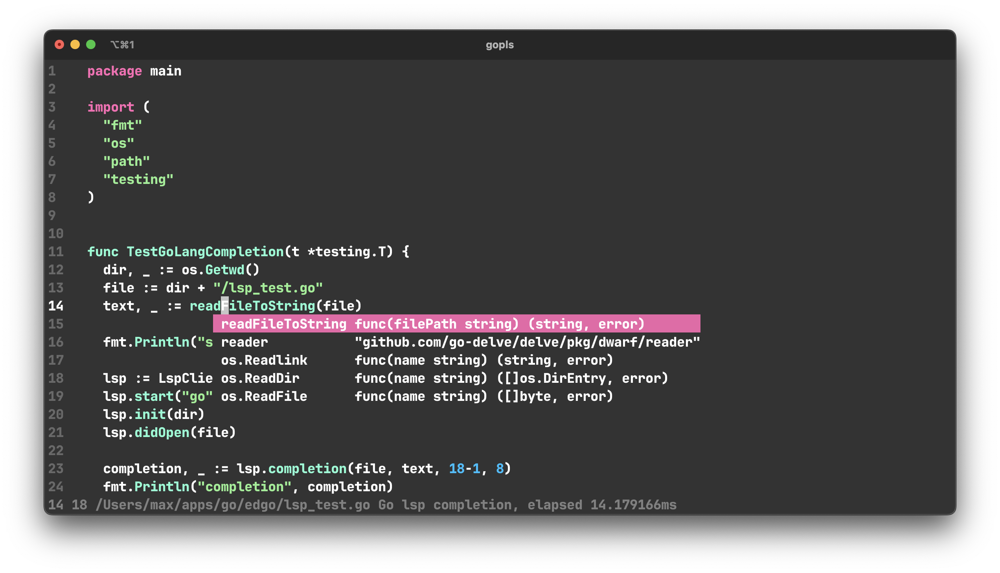

# Edgo
Yet another console text editor

I recommend to map `caps lock` to `control` button for faster writing   

Key bindings:
- Control + s - save file
- Control + q - quit
- Control + d - duplicate line
- Control + x - cut 
- Control + c - copy 
- Control + v - paste
- shift + arrow - select text
- option/alt + arrow - smart movement


  Installation:
```shell
git clone https://github.com/vipmax/edgo && cd edgo
```
build:
```shell
go build 
```
Add alias to  shell environment
```shell
pwd
alias edgo="./$pwd"
