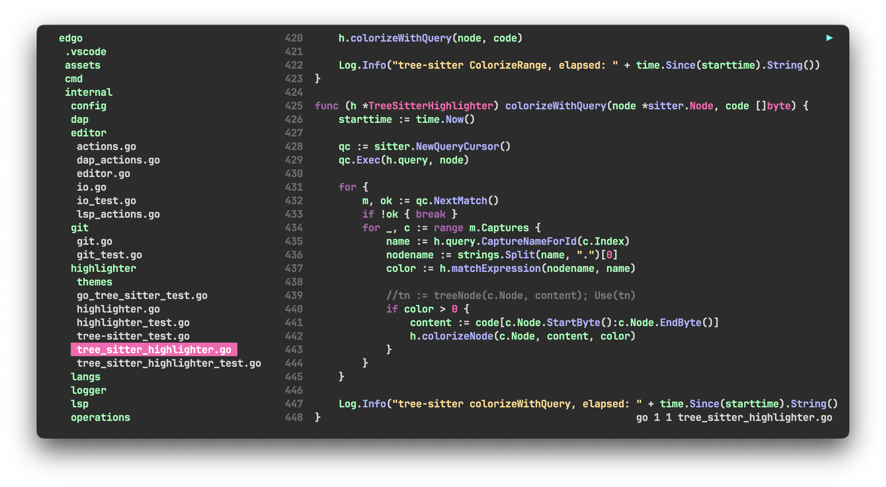
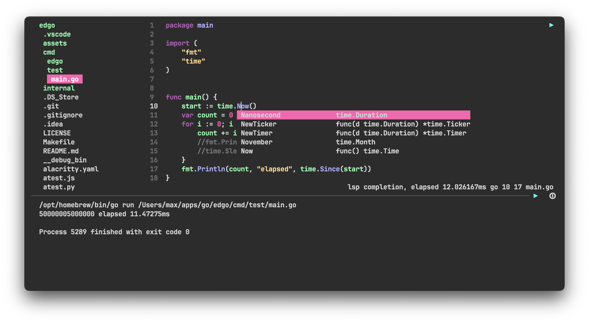
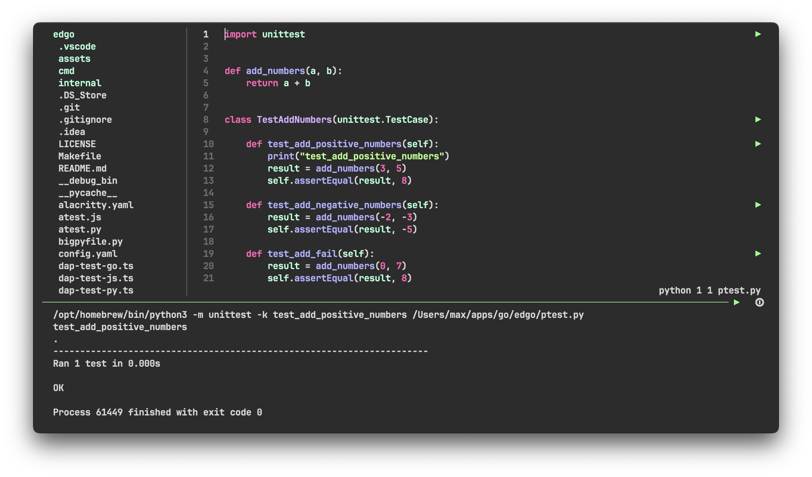
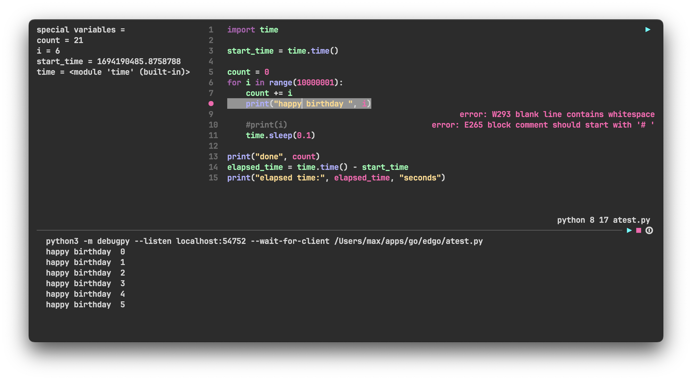

# edgo
Yet another console text editor, but with lsp support



### Demo
https://github.com/vipmax/edgo/wiki/Features

### Key bindings and features:
- `Control + q` - quit
- `Control + d` - duplicate line
- `Control + x` - cut 
- `Control + c` - copy 
- `Control + v` - paste
- `Control + u` - undo
- `Control + f` - find
- `Control + f, type prefix, Control + g` - global find
- `Control + t` - files selection tree
- `Option + /` - comment line
- `Control + o` - cursor back
- `Control + ]` - cursor forward
- `Control + j` - cursor to the top 
- `Control + k` - cursor to the bottom 
- `Control + l + line number` - cursor to the line 
- `Control + y` - lines count report 


- `Shift + arrow` - select text
- `Option + right/left` - smart horizontal movement by words
- `Option + down/up` - smart selection
- `Control + Shift + down/up` - lines swap


- `mouse selection`  - select text 
- `mouse double click`  - select word 
- `mouse triple click`  - select line


- `Control + space` - lsp completion
- `Control + h` - lsp hover
- `Control + p` - lsp signature help
- `Control + g / Control + mouse click` - lsp definition
- `Control + r / Option + mouse click` - lsp references
- `Control + e` - lsp diagnostic (errors)
- `Shift + F6` - lsp rename 
- `Control + w` - method extraction


### Installation:

Install Go for MacOS:
```
brew install go 
echo 'export PATH=$PATH:$(go env GOPATH)/bin' >> ~/.zshrc
```
Clone:   
```shell
git clone https://github.com/vipmax/edgo && cd edgo
make 
```

### Usage:
```
edgo [filename]
edgo ~/.zshrc 

# with no args it will open current directory
edgo 
```

### Support
If you like the project, please support it.  
https://www.buymeacoffee.com/vipmax/edgo


### Configuration

`edgo` uses yaml file for configuration.  
Set `EDGO_CONF` env var to conf file path 
```shell
export EDGO_CONF="/Users/max/apps/go/edgo/config.yaml"
```

### Themes
`edgo` supports themes, set it in config file.  
- edgo
- edgo-light
- dracula
- darcula
- idea-light
- nord
- monokai

### Lsp

Following lsp features are supported:
- completion
- hover
- signature help
- definition
- references
- rename
- method extraction
- diagnostic


Following languages are supported:

`go`
```shell  
go install golang.org/x/tools/gopls@latest
```

`python`
```shell  
pip install -U 'python-lsp-server[all]'
```

`javascript/typescript`
```shell  
npm i -g typescript typescript-language-server
```

`html`
```shell  
npm i -g vscode-langservers-extracted
```

`vue`
```shell  
npm i -g vls
```

`rust`
```shell  
#curl --proto '=https' --tlsv1.2 -sSf https://sh.rustup.rs | sh
rustup component add rust-analyzer
```

`c/c++`
```shell  
# go to https://clangd.llvm.org/installation.html
clangd
```

`java`
```shell  
# jdtls requires at least Java 17, check also JAVA_HOME must be set 
brew install jdtls
```

`kotlin`
```shell  
# https://github.com/fwcd/kotlin-language-server
brew install kotlin-language-server
```

`swift`
```shell  
# https://github.com/apple/sourcekit-lsp
xcrun
```

`haskell`
```shell  
# https://haskell-language-server.readthedocs.io/en/latest/installation.html
ghcup install hls
```

`zig`
```shell  
npm i -g bash-language-server
```

`d`
```shell  
dub fetch serve-d
```

`ocaml`
```shell  
opam install ocaml-lsp-server
```

`bash`
```shell  
# https://haskell-language-server.readthedocs.io/en/latest/installation.html
brew install zls
```


### Tests

Edgo provides a seamless testing experience with the ability to execute tests using a simple button click.

Edgo supports testing functionality using Tree Sitter for `go`, `python`, `javascript`, `java`.  
WIP for other langs



### Debug

Added Debug first implementation

Debug is working via dap protocol for `go` (dlv)  and `python` (debugpy)
WIP for other langs



Usage:
- `control + b` - set/delete breakpoint  
- `control + F11` to start debug  
In debug mode editing is not allowed  
- `c` - continue to the next breakpoint  
- `q` - quit debug  


### Notes:  
- Map `Caps lock` to `Control` button, everything will be easier.  
- Use `Alacritty` as default terminal, it is fast, power efficient end easy to config, use `alacritty.toml` as example .  
- Use `edgo ` as `e`, add alias to shell environment - `alias e="edgo"`
- Use `tmux`. Checkout my `.tmux.conf`(shift and option keys works)
- For `iterm2` use `Natural text editing` preset at `Profiles > Keys > Key Mappings > Presets > Natural text editing > Reset `
- Do not use iterm2, it uses 3 times more cpu then alacritty 
- add bindkey "^[[1;3C" forward-word" and  "bindkey "^[[1;3D" backward-word" to .zshrc to enable word moving with option + arrows in terminak 
